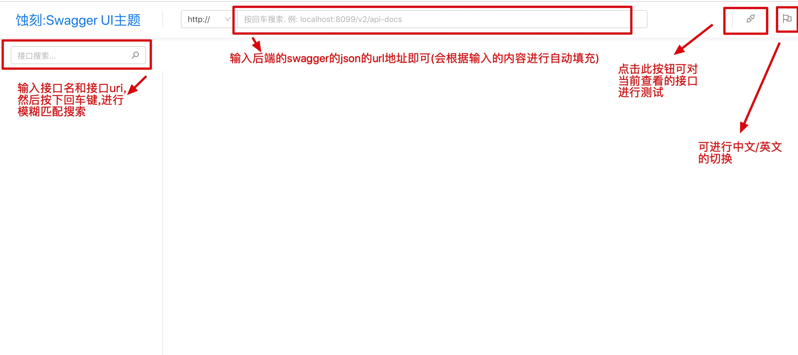
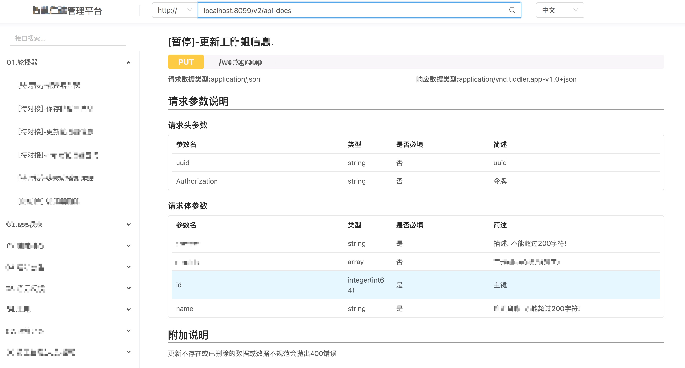
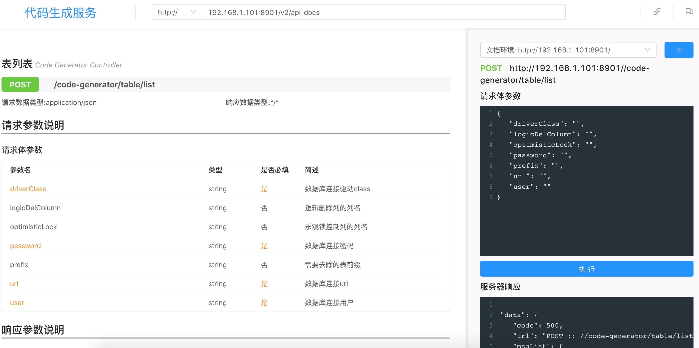

# swagger-ui-theme


## 项目说明

该项目是一个基于react的**纯前端项目**, 目的是提供一套更符合国人习惯的swagger-ui主题

## 采用的技术

react + umiJs + ant design

## 界面






## 运行方式

前提: 需要安装node和umiJs

方式一:
直接将根目录下的`docker/dist`目录拷贝到nginx或tomcat即可直接访问运行

方式二:

* 命令行进入`docker/dist`执行docker命令,打包为一个镜像
 `docker build -t swagger-ui-theme:1.0 .`
* 运行docker容器
  `docker run -d --name swagger-ui-theme -p 8088:80 swagger-ui-theme:1.0` 
* 待容器启动之后,打开浏览器访问 http://localhost:8088

方式三:
进入项目根目录执行`umi dev`即可启动,访问

方式四:
进入项目根目录执行`umi build`即可启动，会生成dist目录,该目录就可以直接放到ngnix运行

## 注意点

* 后端服务一定要启用跨域支持
* 暂不支持对文件上传的接口进行测试
* 对于post文件下载, 服务器端必须明确的指定resonse的produces的值,且文件名必须指定在`Content-Disposition`中,值格式为:`attachment;filename=真正的文件名`,当produces值包含如下任一一个词时,则认为是下载:
  octet-stream, excel, download, pdf, word

post文件下载,后端代码节选:

```java
@PostMapping(value = "download/single", produces = "application/octet-stream")
@ApiOperation(value = "下载单个表的代码")
public void downloadSingle(@RequestBody TableCodeGeneratorConfigDTO tableCodeGeneratorConfigDTO, HttpServletResponse response) throws UnsupportedEncodingException {
    response.reset();
    String fileName = "生成的代码.zip";
    // 对文件名进行url编码,前端需要对文件名进行一次url解码,目的是为了解决中文文件名乱码问题
    String encodeFileName = URLEncoder.encode(fileName, "UTF-8");
    response.setContentType("application/octet-stream");
    // 开启跨域支持
    response.setHeader("Access-Control-Allow-Origin", "*");
    response.setHeader("Access-Control-Expose-Headers", "*");
    // 在response的Content-Disposition中指定文件名
    response.setHeader("Content-Disposition", "attachment;filename=" + encodeFileName);
    response.setHeader("Pragma", "no-cache");
    OutputStream out = null;
    try {
        out = response.getOutputStream();
        this.codeGeneratorService.generatorCode2File(tableCodeGeneratorConfigDTO, out);
    } catch (IOException e) {
        e.printStackTrace();
    } finally {
        if (null != out) {
            try {
                out.close();
            } catch (IOException e) {
                e.printStackTrace();
            }
        }
    }
}
```

关于如何实现post文件下载,可参考我的简书: https://www.jianshu.com/p/a3c921b69ab1


